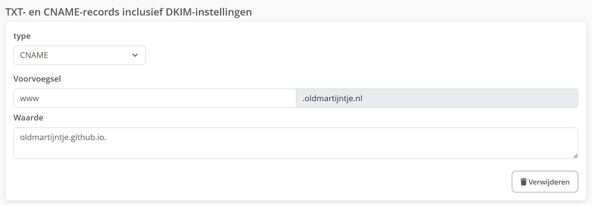

Before running any script i made, commit your changes!! //should turn this into caps

### Navigator

- [My Build Scripts](#my-scripts)
  - [how to configure builderData json](#how-to-configure-builderdata-json)
  - [testbuilder vs builder](#testbuilder-vs-builder)
  - [remove local branches script](#remove-local-branches-script)
  - [problems i solved with my builder](#problems-i-solved-with-my-builder)
- [Hosting with a Different URL](#hosting-with-a-different-url)
- [Angular build variables](#build-specific-variables)
- [gitignore](#gitignore)


# My Scripts

- [Navigator](#navigator)

This is accurate since builder Version 10

place the scripts folder on the same level as the angular project,
for example: 
>`C:/henk/scripts` + `C:/henk/angularProjectFolder/scr/...`, where they are both directly in `C:/henk/`
>
>and not `C:/henk/scripts` + `C:/henk/folder/angularProjectFolder/scr/...`
>
>nor `C:/henk/folder/scripts` + `C:/henk/angularProjectFolder/scr/...`
>
>nor `C:/henk/folder/scripts` + `C:/henk/otherFolder/angularProjectFolder/scr/...`

open the `scripts/builderData.json`, this is the default data. 

If `scripts/builderData.json` does not exist, run `builder.py`, this will give you errors, but i will generate the `scripts/builderData.json` for you.

```json
{
    "BuildNumber": 0,
    "JSONVersion": 3,
    "AngularProjectFolder": "PlayTimeClient",
    "BuildDataPath": "/src/app/Models/buildData.ts",
    "AngularDistName": "play-time",
    "HostToUrl": "https://oldmartijntje.nl",
    "BuilderMakeBranch": true,
    "MainBranch": "main"
}
```

set the `BuildNumber` to 0 to restart the counting of buildnumbers. This increases automatically every time you run `builder.py`.

don't touch `JSONVersion`, this is for me to debug builder script issues.

## how to configure builderData json

- [Navigator](#navigator)

1. `AngularProjectFolder`

    if this is your configuration: 
    >`C:/henk/scripts` & `C:/henk/myAngularApp/scr/...`

    then you should set `AngularProjectFolder` to `"myAngularApp"`

2. `BuildDataPath`

    this is where your buildData wil get saved into the reposetory. So that you can display builddata in the running angular application

    Set this to wherever you want this to be located inside your angular project. You can change the name too. Purely preference.

    Make sure the parent folder exists beforehand, file itself doesn't need to exist.

    Adding extra data in here will be overwritten.

3. `AngularDistName`
    - go into `angular.json`
    - press CTRL+F
    - search for `"outputPath": "dist/`
    - copy the thing that comes after, for example:
        >If it is 
        >
        >`"outputPath": "dist/play-time",`
        >
        >Then you copy the `play-time`
    - replace the value of `AngularDistName` with the thing you copied.

4. `HostToUrl`

    this is the url you want to host to. For example I am hosting to `https://oldmartijntje.nl`

    But you can also use `https://yourGithubUsername.github.io/YourGithubRepo` if you are using default github pages.

5. `BuilderMakeBranch`

    the builder.py defaultly makes a new branch when you build. You can disable that here.

6. `MainBranch`

    after making a new branch for each build, it switches back to this branch. If `BuilderMakeBranch` is set to `false`, this still needs to be set accurately.

7. `GitRepo`

    The path to your git repo, so that the last commit url will work

## testbuilder vs builder

- [Navigator](#navigator)

builder.py updates the buildId and data. It also makes a new branch (if enabled), testbuilder.py doesn't. testbuilder.py just builds the page in it's current state to github pages.

## remove local branches script

- [Navigator](#navigator)

If you run this, it removes the local branches from your pc, make sure you commit beforehand.

# problems i solved with my builder

- [Navigator](#navigator)

1. manually having to run `npm install`, and the 2 build commands
2. angular routing problem. Where going to a route will cause errors unless the page sends you there.
3. manually having to set a build number.
4. teamwork issues: 
    - not knowing if it is up to date on the active build.
    - Who builded the new version? It wasn't ready yet
    - did you build from dev? or from a feature branch?

# hosting with a different url

- [Navigator](#navigator)

there are a fex steps:

1. get a domain
2. set the DNS `A-record` to the following IP: `185.199.108.153`
3. set the CNAME, this is important for https, if using http, might be optional:
    >
    This is a screenshot from strato
4. add a `CNAME` file in the `src/` folder of your angular project.
    this `CNAME` file must contain your webAdress, for example: `oldmartijntje.nl`
5. go to `angular.json`, somewhere in there there is the following:
    ```json
    "assets": [
        "src/favicon.ico",
        "src/assets"
    ],
    ```
    Add `"src/CNAME"`:
    ```json
    "assets": [
        "src/favicon.ico",
        "src/assets",
        "src/CNAME"
    ],
    ```
    If this code snippit appears multiple times, make sure you have the one inside of `"build": {` and not `"test": {`
        
# build specific variables

- [Navigator](#navigator)

To make variables you can only see when you run it local, or only in production. Follow these steps.

- go into your `src/` folder and make a new folder. i always call this `environment/`
- inside this folder make 2 files: `environment.ts` and `environment.prod.ts`
- paste the following into these files: 
    ```ts
    export const environment = {
        production: false
    }
    ```
    and set production to true in the `environment.prod.ts`
- go to the `angular.json`
- find `"architect": { "build": {`
- inside `"build"` go to `"configurations"` and then `"production"`
- paste the following json in this dict:
    ```json
    "fileReplacements": [
        {
            "replace": "src/environments/environment.ts",
            "with": "src/environments/environment.prod.ts"
        }
    ],
    ```
    If you chose a different path or name, then use your corresponding paths.

Now you should be able to import environment in every typescript file, and use the variables in there.

When you run it locally, it will use the variables from `"src/environments/environment.ts"`.
And when you build this script (using 1 of the 2 builders), it will use the variables from `"src/environments/environment.prod.ts"`,

# gitignore

- [Navigator](#navigator)

i reccomend to put the following in a .gitignore file:

```
BuilderData.json
environment.prod.ts
```